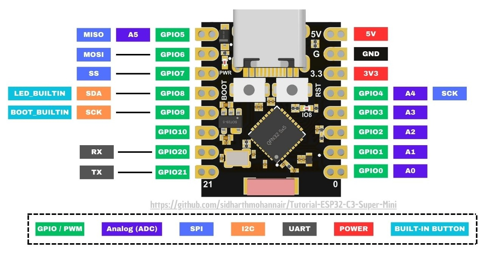

# Desk Control Panel

## Design Requirements

A control panel for under my desk that allows me to control my KVM as well as other peripherals.

A MCU like an ESP32-C3 enables a fancier interface with a 0.96" OLED screen.

### Peripherals

- 2 x HDMI switch (2IN-1OUT)
- USB hub switch
- Speaker channels (left and right)
- 3 x USB power

> The HDMI switches and the USB hub switch are existing standalone devices so these will be controlled by buttons directly without the MCU. The USB power switches will be controlled directly by the ESP32.

#### HDMI Switch

The 2 IN - 1 OUT HDMI switch has 3 control pins:

- GND
- INPUT
- 3.2V

When the INPUT is pulled to GND, the switch's output is the HDMI Input A.
When the INPUT is pulled to 3.2V, the switch's output is the HDMI Input B.
When the INPUT is floating, the switch's output is unstable and may not output anything.

The INPUT control pin will be driven by a simple latching switch and a 10kΩ pull-up or pull-down resistor.

The voltages of the switch pins are as follows:

```
With the stock switch:
          ┌─────┐
┌─────────└─────┘─────────┐
│       5.2V   GND        │
│ ┌───┐  │      │   ┌───┐ │
│ │ON │ 5.2V   0V   │OFF│ │
│ └───┘             └───┘ │
│       4.9V   3.2V       │
└─┌─────┐─────────┌─────┐─┘
  └─────┘         └─────┘

          ┌─────┐
┌─────────└─────┘─────────┐
│       5.2V   GND        │
│ ┌───┐  │          ┌───┐ │
│ │OFF│ 4.9V   0V   │ON │ │
│ └───┘  │      │   └───┘ │
│       4.9V   3.2V       │
└─┌─────┐─────────┌─────┐─┘
  └─────┘         └─────┘

```

```
With the stock switch removed:
          ┌─────┐
┌─────────└─────┘─────────┐
│       5.2V   GND        │
│ ┌───┐             ┌───┐ │
│ │ ~ │ 1.3V   1.5V │ ~ │ │
│ └───┘             └───┘ │
│       4.9V   1.5V       │
└─┌─────┐─────────┌─────┐─┘
  └─────┘         └─────┘
```

The INPUT control pin will be driven by a simple latching switch and a 10kΩ pull-down resistor.

There are two LEDs to indicate which computer is being used as the source. These can be tapped into in order to get the current state to be read by the ESP32 and displayed on the OLED screen.
When active, the LED has a 1.8V potential difference. However, relative to a shared GND, these are the observed voltages in the various states:

| LED A State | LED A Pin 1 | LED A Pin 2 | LED B State | LED B Pin 1 | LED B Pin 2 |
| ----------- | ----------- | ----------- | ----------- | ----------- | ----------- |
| ON          | 0V          | 2.5V        | OFF         | 0V          | 0V          |
| OFF         | 0V          | 0V          | ON          | 0V          | 2.5V        |

> [!NOTE]
> Due to lack of pins on the ESP32-C3, the state of the HDMI Switches will *not* be monitored by the ESP32-C3. The latching switches should be sufficient for state UI.

#### USB Hub Switch

The USB hub switch directs 4 USB ports between upstream computer A or upstream computer B.

There are two control pins with a 4.75V potential difference. When these two control pins are bridged, the hub toggles the USB source.
These will be driven by a momentary button switch.

There are two LEDs to indicate which computer is being used as the source. These can be tapped into in order to get the current state to be read by the ESP32 and displayed on the OLED screen.
When active, the LED has a 1.9V potential difference. However, relative to a shared GND, these are the observed voltages in the various states:

| LED A State | LED A Pin 1 | LED A Pin 2 | LED B State | LED B Pin 1 | LED B Pin 2 |
| ----------- | ----------- | ----------- | ----------- | ----------- | ----------- |
| ON          | 0V          | 1.9V        | OFF         | 5V          | 5V          |
| OFF         | 5V          | 5V          | ON          | 0V          | 1.9V        |

Since all pins go to 5V in some state is necessary to leverage a voltage divider in order to read the 5V signals with a 3.3V ESP32.
The voltage divider could consist of 10kΩ/20kΩ resistors:

```
V_out = V_in * (R2 / (R1 + R2))
V_out = 5V * (20kΩ / (10kΩ + 20kΩ))
      = 5V * (20,000 / 30,000)
      = 5V * 0.6667
      ≈ 3.33 V

I_total = V_in / (R1 + R2)
        = 5V / (10kΩ + 20kΩ)
        = 5V / 30kΩ
        ≈ 0.000167 A
        = 167 µA

P_total = V_in × I_total
        = 5V × 0.000167 A
        ≈ 0.000833 W
        = 0.833 mW
```

> [!NOTE]
> Since the USB hub switch is triggered with a momentary switch rather than a latching switch, the ESP32-C3 will monitor state for presentation to the user on the OLED screen. The monitored pins are `LED A Pin 1` and `LED B Pin 1`.

#### Speaker Channels

There is currently two toggle switches that are manually spliced into the 3.5mm audio cables from two computers to direct the output from each computer to the speaker left and right channels.
This implementation will remain the same as this simple analog switching is working well.

> [!NOTE]
> The toggle switches are sufficient state UI and therefore does not require monitoring by the ESP32-C3.

- [x] Refine design of enclosure
    - Orient inputs and outputs on the same side
    - Use PETG instead of PLA for better durability
    - Use fuzzy skin to camouflage layer lines for improved aesthetics
- [~] Redo connections to use hot-swappable DuPont connectors and longer, more flexible stranded wires

#### USB Power

Control USB power using MOSFETs. Planned USB-powered peripherals include:

- Pyle PAD43MXUBT Audio Mixer (500mA @ 5V)
- Meeting Sign (200mA @ 5V)

To be triggered by an MCU, this should be accomplished with a _logic level_ P-Channel MOSFET. The MOSFET should be logic level in order to be driven by a 3.3V ESP32 directly. The IRLML6402 is widely available and cheaper but without features like short-circuit and thermal protection of a dedicated USB Switch IC.

Using an N-Channel MOSFET is not ideal because the USB spec assumes GND is always connected and stable.

Using the P-Channel MOSFET should include

- A 1kΩ inline series gate resistor to reduce inrush current and EMI when switching the gate. [Source](https://www.build-electronic-circuits.com/mosfet-gate-resistor/)
- A 10kΩ pull-up resistor to ensure the MOSFET stays off during MCU boot/reset, while the GPIO is floating.

##### Meeting Sign

An [existing project](https://github.com/noahbaculi/embedded-meeting-sign) that is USB-powered and utilizes an Arduino Nano to countdown a timer and indicate the remaining duration on a series of LEDs.
The Meeting Sign will be powered via one of the USB Power MOSFETs controlled by the MCU.

- [x] Rewrite firmware
    - [x] Use the ESP32-C3 instead of the Arduino Nano in order to use consistent `esp-hal` and `embassy` tooling
    - [x] Allow the timer to be controlled via UART
    - [x] If no UART commands are received, there should be a default timer
    - [x] There should be a `SENSE` connection between the Meeting Sign ESP32-C3 and the Control Panel ESP32-C3 that allows the Control Panel to detect if the Meeting Sign is online
        - This can be a Meeting Sign output that is set high when the Meeting Sign is online and low when it is not
        - The Control Panel can use this signal on an input with a pull-down resistor to determine if the Meeting Sign is online and display the status on the OLED screen
    - [x] Once a timer completes, the ESP32-C3 should go into deep sleep
    - [ ] Archive the previous version of the repository with a link to this new version
- [x] Refine design of enclosure
    - [x] Shrink footprint thanks to smaller size of the ESP32-C3
    - [x] Use USB-C socket instead of Arduino Nano's micro USB for power
    - [x] Use power switch for manual operation if not using the Meeting Sign with the Control Panel

### Important Concepts

- Make sure to connect the grounds of all the peripherals.

## High Level Wiring Diagram


## Back Module Distribution PCB Schematic


## Firmware Development

This project is built in a `no_std` environment utilizing the `esp-hal` crate in conjunction with the [Embassy](https://embassy.dev/) framework.

<!-- - Rust via [rustup](https://rustup.rs/) -->
<!-- - Install [ESP32 Rust tooling](https://docs.esp-rs.org/book/installation/index.html) -->
<!---->
<!-- ```shell -->
<!-- cargo install espup -->
<!-- espup install -->
<!-- ``` -->

### Commands

Flash binaries

```shell
cargo run --release --bin control_panel
cargo run --release --bin meeting_sign
```

Run tests

```shell
cargo test --config .cargo/probe-rs.toml
```

## Reference

[ESP32-C3 GPIO Summary](https://docs.espressif.com/projects/esp-idf/en/stable/esp32c3/api-reference/peripherals/gpio.html)

### ESP32 C3 SuperMini Pinout


